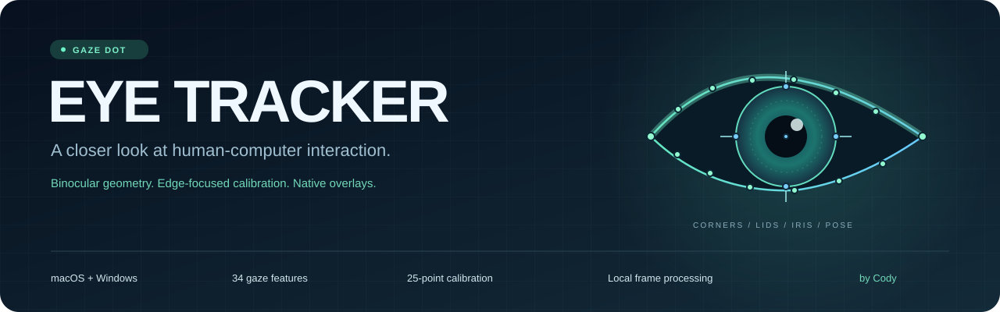
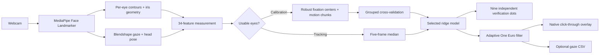

<p align="center">
  
</p>

<p align="center">
  <a href="https://github.com/ItsMeCodyy/Eye-Tracker/actions/workflows/ci.yml"></a>
  
  
  <a href="LICENSE"></a>
  
</p>

<p align="center">
  <strong>Your webcam. Both eyes. A calibrated view of where you look.</strong><br>
  A desktop computer-vision project exploring gaze estimation, human-computer interaction, and reliable real-time software.
</p>

<p align="center">
  <a href="#quick-start">Quick start</a> ·
  <a href="#what-it-does">Features</a> ·
  <a href="#how-it-works">How it works</a> ·
  <a href="#engineering-notes">Engineering</a> ·
  <a href="#development">Development</a>
</p>

---

**Eye Tracker** turns a normal webcam into a calibrated gaze estimator and draws a soft, click-through gaze blob over your selected display. It follows eye movement while accounting for head pose, ignores blinks and unusable frames, and reports accuracy using points excluded from model training.

This builds on the original **Gaze Dot** implementation. Its macOS overlay behavior and faster 13-point calibration remain available, alongside a more detailed eye scan, a 25-point precision mode, and Windows support.

> Webcam gaze estimation is an approximation. More detailed features and calibration improve the tools available to the model; they do not guarantee a particular accuracy for every camera or person. The app measures your session instead of advertising a fixed precision.

## What it does

| Capability | Implementation |
| :-- | :-- |
| **Detailed eye geometry** | Both corners, 16 contour landmarks, and the iris center plus four ring landmarks per eye. Tracks anatomical left and right eyes independently. |
| **34 engineered features** | Iris offsets, lid opening, iris position within the lids, inner and outer lid geometry, iris size and depth, binocular differences, blendshape gaze, and six head-pose measurements. |
| **Edge-focused calibration** | A 25-point grid extending to 4% and 96% of the display, plus three head-motion targets. Original 13-point calibration is selectable. |
| **Independent verification** | Nine additional dots measure typical and worst error for the actual model used for tracking. Verification frames never become training data. |
| **Automatic model selection** | Compares 240 feature, head-pose, curvature, and regularization configurations using held-out calibration groups. Prefers simpler models when scores are close. |
| **Native overlay** | Transparent and click-through; macOS Spaces and full-screen auxiliary behavior, plus Windows topmost/no-activation support. |
| **Live diagnostics** | Mirrored webcam preview with eye contours and iris rings, separate eye-opening measurements, blink state, head angles, image-quality heuristic, and processing FPS. |
| **Session controls** | Camera and display selection, three smoothing modes, adjustable blob size, pause/resume, and recalibration. |
| **Save and export** | Save/load numeric JSON calibration profiles. Opt in to timestamped gaze-coordinate CSV recording. |
| **Local processing** | No account, cloud inference, or video recording. The official face model downloads once and is checked against a pinned SHA-256 hash. |

## Quick start

You need a webcam and **64-bit Python 3.9–3.12**. Python **3.11** is recommended for a new installation. The pinned MediaPipe version does not support Python 3.13+.

### macOS

```sh
git clone https://github.com/ItsMeCodyy/Eye-Tracker.git
cd Eye-Tracker
chmod +x "Run Gaze Dot.command"
./"Run Gaze Dot.command"
```

You can also double-click **Run Gaze Dot.command** in Finder. The launcher creates `.venv.nosync`, installs the dependencies, and starts the app. The `.nosync` suffix preserves the original workaround for iCloud hiding Qt plugins inside Documents.

Allow camera access when prompted. If access was previously denied, enable the launching app under **System Settings → Privacy & Security → Camera**.

### Windows 10 / 11

1. Install [64-bit Python 3.11](https://www.python.org/downloads/), including the **Python launcher**.
2. Clone this repository, or download and extract its ZIP.
3. Double-click **Run Gaze Dot.bat**.

The launcher creates `.venv`, installs platform-appropriate dependencies, and starts the app. Cocoa/PyObjC is installed **only on macOS**.

```powershell
git clone https://github.com/ItsMeCodyy/Eye-Tracker.git
cd Eye-Tracker
& '.\Run Gaze Dot.bat'
```

If Windows blocks camera access, open **Settings → Privacy & security → Camera** and allow desktop apps to access the webcam.

<details>
<summary><strong>Manual installation</strong></summary>

macOS:

```sh
python3 -m venv .venv.nosync
source .venv.nosync/bin/activate
python -m pip install -r requirements.txt
python eye_tracker.py
```

Windows PowerShell:

```powershell
py -3.11 -m venv .venv
.\.venv\Scripts\python.exe -m pip install -r requirements.txt
.\.venv\Scripts\python.exe eye_tracker.py
```

On Linux, the Qt overlay and automatic OpenCV camera backend are available, and Linux participates in CI. Desktop compositor behavior varies; native integration targets macOS and Windows.

</details>

## Using the tracker

Choose your display, camera index, and calibration mode, then click **Scan, calibrate and start**. The controls stay available throughout the session.

1. **Eye scan.** Look at the center dot. The app measures both eyelids, iris size, lighting, estimated distance, and head position.
2. **Calibration.** Follow each target until it moves. Amber means settling; green means collecting samples. A ring shows capture progress. Unclear or unstable captures retry up to three times.
3. **Head compensation.** Keep looking at each target while slowly moving your head left, right, up, and down. Stay within movements you expect to make during tracking.
4. **Verification.** Follow nine additional targets. The app measures per-dot error before enabling the gaze blob.

Precision mode takes roughly **two minutes**; quick mode takes roughly **one minute**, excluding retries, camera startup, and model selection.

Use even light, keep both eyes visible, and sit as you will during tracking. Recalibrate after moving the camera, changing seats, or substantially changing lighting. Large movements outside the calibration range reduce reliability.

| Control | Behavior |
| :-- | :-- |
| **Pause overlay** | Hides the blob while keeping camera diagnostics active. CSV sample collection pauses. |
| **Stop tracking** | Hides the overlay, closes CSV recording, and releases the camera. |
| **Save / load calibration** | Stores numeric model parameters and scan/verification metadata. Loading requires matching display name, dimensions, camera index, and feature schema. |
| **Record gaze CSV** | Saves smoothed display and desktop coordinates only after you choose an output file. Click again to stop and flush the file. |
| **Smoothing** | Balanced, Responsive, or Smooth; switching resets the filter. |
| **Gaze blob size** | Adjusts the visible radius without altering the underlying gaze prediction. |

**Keyboard shortcuts:** `Esc` stops, `Space` pauses/resumes, and `Ctrl+R` recalibrates **while the control window has focus**. The click-through overlay does not register global shortcuts.

## How it works



MediaPipe supplies the face landmarks and expression coefficients. The project derives **eye-relative measurements** so eye geometry remains comparable when the face changes size or rolls. It retains the original averaged features and adds independent eye measurements instead of discarding the established pipeline.

Calibration captures become robust fixation centers, reducing jitter without training the model on hundreds of nearly identical frames. Head-motion captures are split into weighted chunks. Ridge regression is tested with multiple eye/head feature sets and linear or quadratic mappings. Cross-validation holds out **entire target groups**, rather than neighboring frames from the same dot.

Live predictions use a five-frame median followed by an adaptive One Euro filter: stronger smoothing during fixation and a quicker response to large movements. Either-eye blinks and low-quality geometry are excluded. The overlay hides after 300 ms without a usable eye measurement and resumes when usable measurements return.

## Understanding accuracy

- **Typical error** is the median of the nine per-target mean errors. **Worst error** is the largest per-target mean error.
- Verification uses the same five-frame feature median as live prediction. It measures predictions **before** the final display smoothing filter; actual visible behavior also depends on smoothing and motion.
- Coordinates and pixel error use Qt **logical display pixels**. On Retina or scaled Windows displays, these differ from physical panel pixels.
- Approximate angular error is shown when physical display width and a plausible model-estimated viewing distance are available. Display metadata and face-based distance can be inaccurate.
- The **image-quality score is a heuristic**, derived from iris size, lighting, lid opening, and whether the eye contours are in frame. It is not a probability that the gaze prediction is correct.
- Loading a saved calibration does not remeasure accuracy. Its verification results belong to the earlier session.

No real-world accuracy benchmark or universal FPS claim is supplied. Actual results depend on the webcam, face, glasses, lighting, head movement, and calibration quality.

## Engineering notes

```text
Eye-Tracker/
├── eye_tracker.py          # Qt controls, capture worker, calibration state machine, CSV/profile I/O
├── face_scan.py            # Verified model download, contours, iris and head-pose measurements
├── gaze_model.py           # Robust sampling, grouped CV, ridge regression, JSON model, filtering
├── screen_overlay.py       # Painting and native macOS/Windows overlay integration
├── Run Gaze Dot.command    # macOS environment/setup launcher
├── Run Gaze Dot.bat        # Windows environment/setup launcher
├── requirements.txt       # Established dependency stack with platform-specific Cocoa
├── tests/test_tracker.py   # Camera-free numerical, geometry, and application regression tests
├── .github/workflows/ci.yml
└── docs/assets/banner.svg
```

The project demonstrates practical computer-vision and desktop engineering:

- **Concurrency:** camera inference and model selection run in Qt workers; stopping requests asynchronous cleanup without blocking the controls. The fitting worker reserves a 16 MiB native stack before starting, preventing OpenBLAS stack overflow on macOS's smaller default worker stacks.
- **Numerical reliability:** feature scaling floors, robust sample rejection, weighted ridge fitting, bounded extrapolation, and preference for simpler models.
- **Evaluation discipline:** calibration-group cross-validation and nine separate verification targets, with no verification-to-training leakage.
- **Platform integration:** native macOS Spaces behavior, pointer-safe Win32 window APIs, high-DPI logical coordinates, and selected-display positioning.
- **Resilience:** camera-backend fallback, model hash verification, partial-download cleanup, bounded capture retries, and lost-eye recovery.
- **Reproducibility:** versioned JSON feature schemas, validated numeric profile shapes, dependency compatibility checks, and OS/Python test matrices.

### Data handling

Camera frames are processed in memory and are not saved or uploaded. The first model download is the only application network request; subsequent tracking can run offline once dependencies and the model are present.

Calibration files contain personal eye/head measurements, fitted parameters, and session metadata. CSV files contain timestamped gaze coordinates. Save/export actions are explicit, and typical calibration/session filenames are ignored by Git. Avoid committing personal exports under other filenames.

CSV columns:

```text
elapsed_seconds,display_x,display_y,desktop_x,desktop_y,
gaze_fraction_x,gaze_fraction_y,image_quality_heuristic
```

`display_x/y` are smoothed positions relative to the selected screen. `desktop_x/y` include that screen's desktop offset, including negative offsets for screens left or above the primary screen. `gaze_fraction_x/y` are the smoothed positions normalized to the selected display. Blinks, unusable measurements, and paused periods produce no sample rows.

## Troubleshooting

| Symptom | What to check |
| :-- | :-- |
| Camera unavailable | OS camera permissions; close apps occupying the webcam; try another camera index. |
| Repeated calibration retries | Add soft front lighting, reduce glare, keep both eyes visible, and hold gaze on the dot. |
| Drift after moving | Recalibrate in the new seat/camera position. Use the head-motion step to cover realistic movement. |
| Windows install fails | Use 64-bit Python 3.11 and check that the Python launcher is installed. Python 3.13+ is unsupported by the pinned stack. |
| Qt plugin failure in an iCloud folder | Use the macOS launcher, which installs into `.venv.nosync` and clears hidden file flags. |
| Python quits unexpectedly while choosing the calibration model | Update to the latest code. The fitting worker now reserves enough native stack for NumPy/OpenBLAS; no dependency reinstall is needed for this fix. |
| Overlay missing over a Windows game | Try windowed or borderless mode. Exclusive fullscreen can bypass ordinary desktop overlays. |
| Saved calibration rejected | Select the original screen/camera, or calibrate again after changing the display geometry or feature schema. |
| First-run model download fails | Check the network connection and restart. Unverified partial downloads are removed automatically. |

## Development

After installing the dependencies:

```sh
python -m pip check
python -m compileall -q eye_tracker.py face_scan.py gaze_model.py screen_overlay.py
python -m unittest discover -s tests -v
```

Tests run with Qt's offscreen platform and do not open your webcam. They exercise contour rotation/scale invariance, head transforms, outlier rejection, fixation stability, motion chunk weighting, unseen-edge predictions on synthetic data, model cancellation, profile validation, filtering, both calibration modes, blink/quality gating, camera startup and fallback, verification isolation, pause/recovery, image memory ownership, and CSV cleanup. A separate subprocess runs complete model selection through the actual background worker and checks delivery of its fitted model, catching native stack crashes that main-thread numerical tests miss.

GitHub Actions runs the suite on **macOS, Windows, and Linux**, using **Python 3.11 and 3.12**. These checks validate software behavior; physical webcam accuracy and native overlay placement still require testing on actual hardware.

On Apple Silicon, recent versions of `pip check` may report that MediaPipe 0.10.21 is unsupported despite its working universal2 binaries. This is a [documented upstream wheel-metadata defect](https://github.com/google-ai-edge/mediapipe/issues/6112). CI verifies native imports, recognizes only that exact message on ARM macOS, and still fails on every other compatibility error.

## Credits & license

Created by **[Cody / @ItsMeCodyy](https://github.com/ItsMeCodyy)**. Built with [MediaPipe Face Landmarker](https://ai.google.dev/edge/mediapipe/solutions/vision/face_landmarker/python), [OpenCV](https://opencv.org/), [NumPy](https://numpy.org/), and [PySide6 / Qt](https://doc.qt.io/qtforpython-6/). Native overlay behavior uses [AppKit](https://developer.apple.com/documentation/appkit) and [Win32](https://learn.microsoft.com/en-us/windows/win32/api/winuser/nf-winuser-setwindowpos).

Project code is licensed under [MIT](LICENSE). Third-party libraries and the downloaded MediaPipe model retain their respective licenses.
